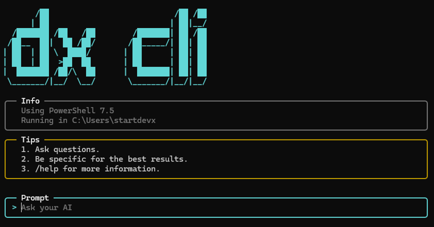

# Get Started With DX CLI

[]()
[]()
[]()



## What is DX CLI?

DX CLI removes your organization's frictions of internal tools and documentation discovery so your engineers can focus on building, not hunting. 

Discover tools instantly, integrate your own corporate AI solutions, and create custom workflows that make every engineer more efficient.

**The result?** Faster onboarding, smoother collaboration, and a developer experience that actually works.

## 💻 Install PowerShell 7.x

> [!NOTE]
> **DX CLI requires PowerShell 7.x** to run. **On Windows, DX CLI can run without PowerShell 7.x installed and works with the built-in Windows PowerShell 5.1**. However, relying on the older version limits your ability to customize the user interface of DX CLI, but it does not prevent you from using the main features.

Follow the official instructions to install PowerShell 7.x on your operating system:

* [Install PowerShell 7.x on Windows](https://learn.microsoft.com/en-us/powershell/scripting/install/install-powershell-on-windows)
* [Install PowerShell 7.x on macOs](https://learn.microsoft.com/en-us/powershell/scripting/install/install-powershell-on-macos)
* [Install PowerShell 7.x on Linux](https://learn.microsoft.com/en-us/powershell/scripting/install/install-powershell-on-linux)

Whether you use Windows PowerShell 5.1 or PowerShell 7.x, it must run in `FullLanguage` mode. You can check the current mode by running the following command in a PowerShell session:

```powershell
$ExecutionContext.SessionState.LanguageMode
```

## Clone DX CLI

Clone DX CLI repository from GitHub to your local machine:

```shell
git clone https://github.com/startdevx/dx-cli
```

## Add `/bin` to Your `PATH`

To use DX CLI from your terminal, add DX CLI `/bin` directory to your `PATH` environment variable.

### On Windows

Open a PowerShell terminal and run the commands below:

```powershell
$dxCliBinPath = "[PUT_YOUR_DX_CLI_BIN_FOLDER_PATH_HERE]"
$regKey = [Microsoft.Win32.Registry]::CurrentUser.OpenSubKey("Environment", $true)
$currentPath = $regKey.GetValue("PATH", "", "DoNotExpandEnvironmentNames")
$regKey.SetValue("PATH", "$dxCliBinPath;$currentPath", "ExpandString")
```

Then open a new terminal session.

**Congratulations! You can now use `dx` in your terminal.**

### On macOS/Linux

Edit your `.zshrc` or `.bashrc` file and append the following lines at the end:

```shell
chmod +x [PUT_YOUR_DX_CLI_BIN_FOLDER_PATH_HERE]/dx
export PATH="[PUT_YOUR_DX_CLI_BIN_FOLDER_PATH_HERE]:$PATH"
```

After saving the file, open a new terminal session.

**Congratulations! You can now use `dx` in your terminal.**

## 🪙 Credits

DX CLI is an open-source solution available on [GitHub](https://github.com/startdevx/dx-cli), crafted by [Start DevX](https://github.com/startdevx) organization.
